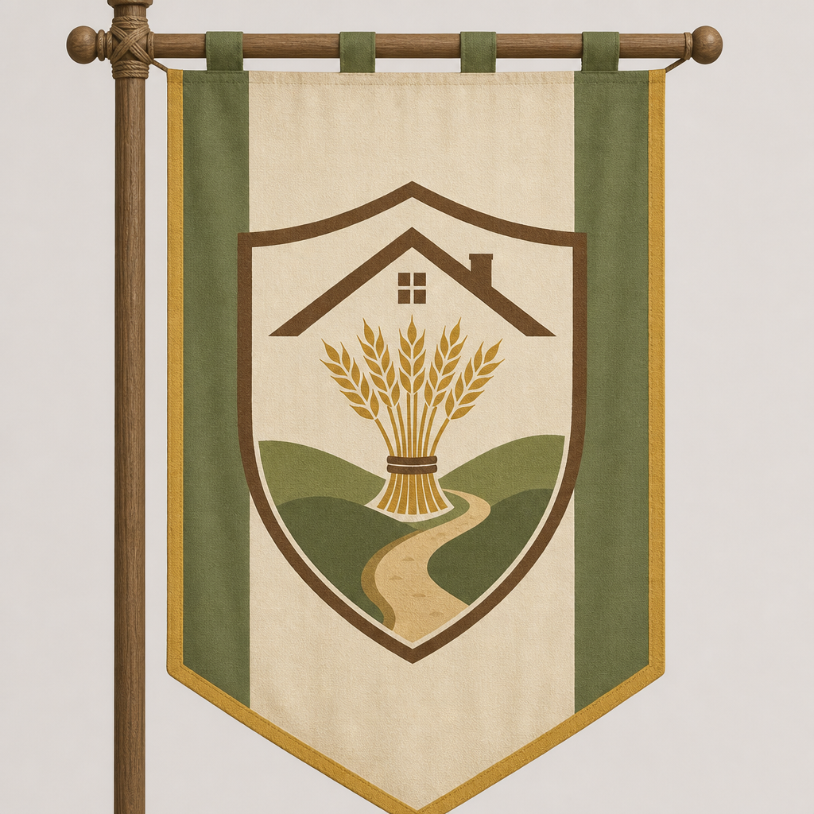
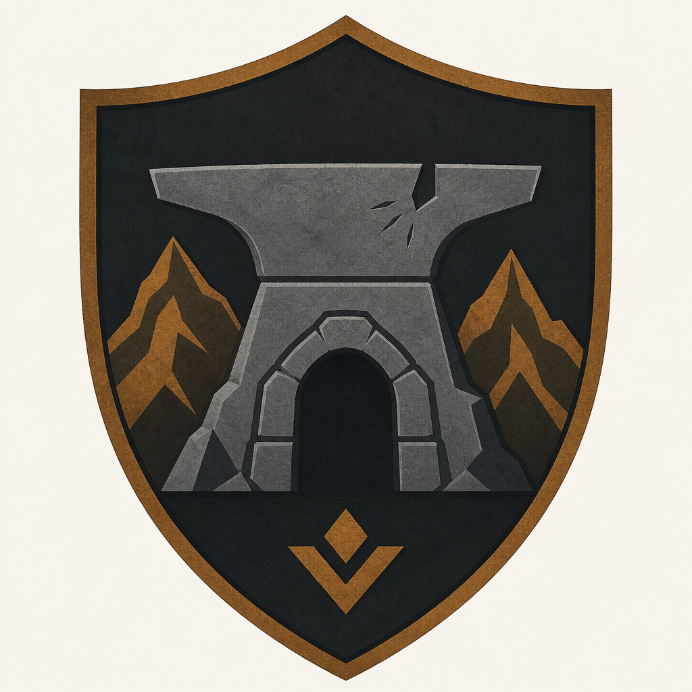
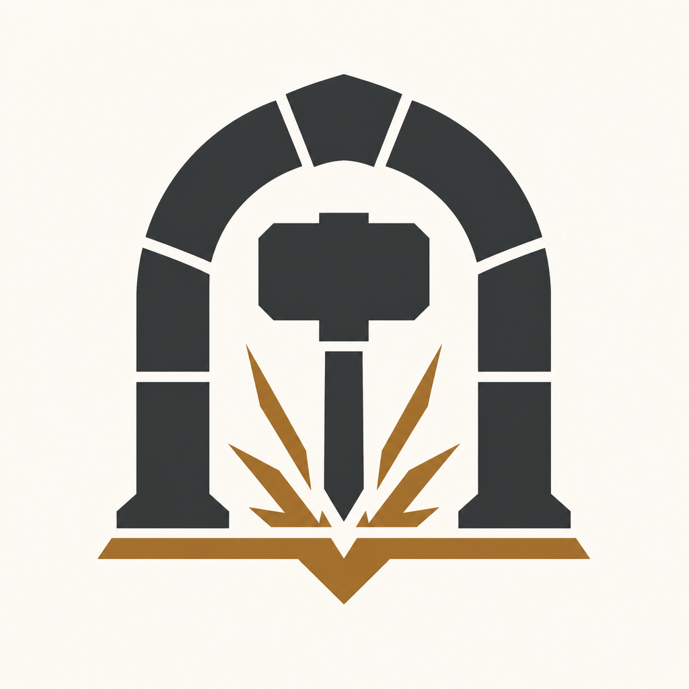
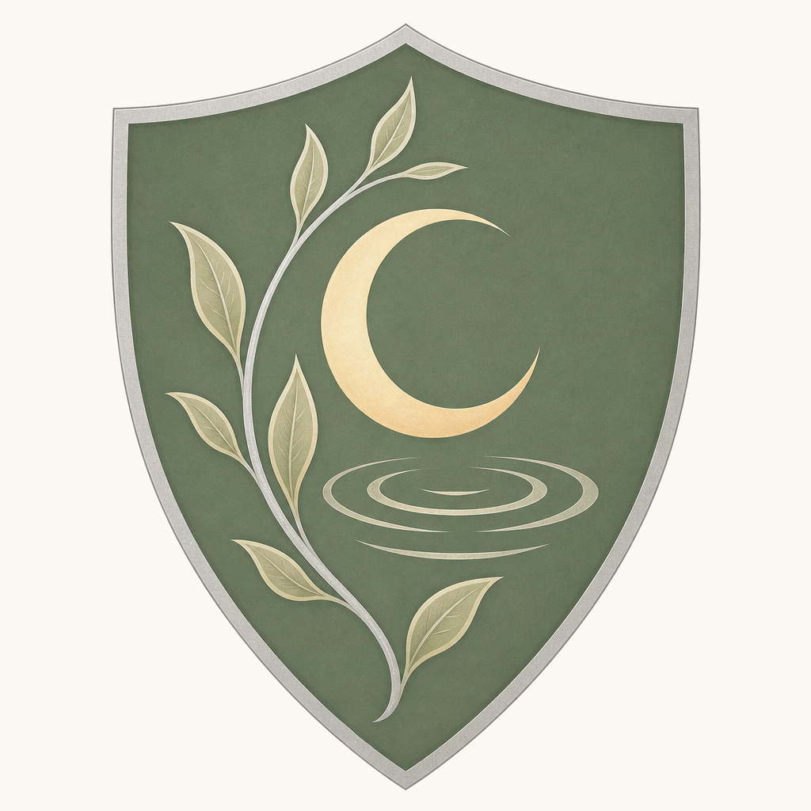
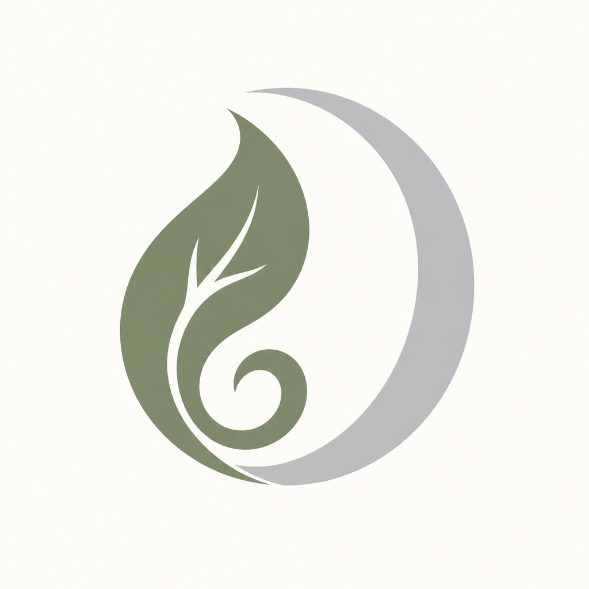
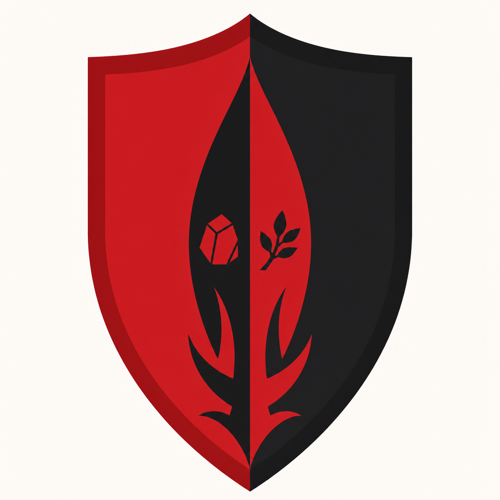
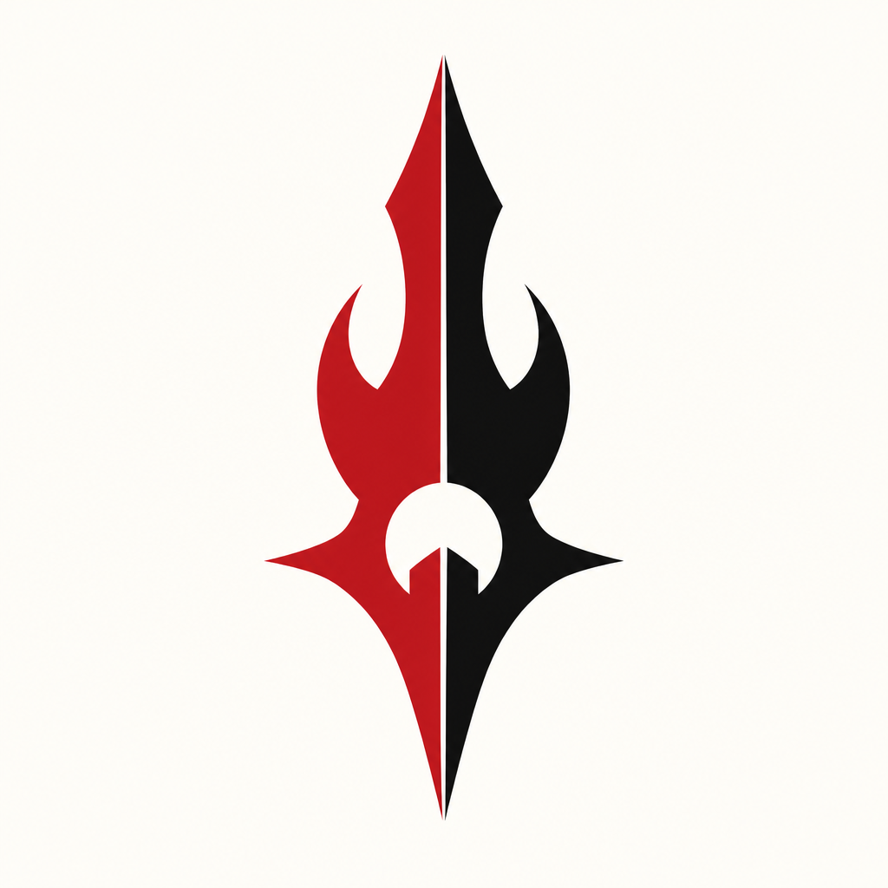
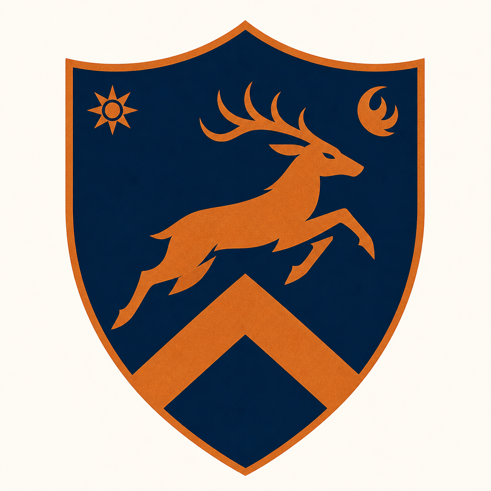
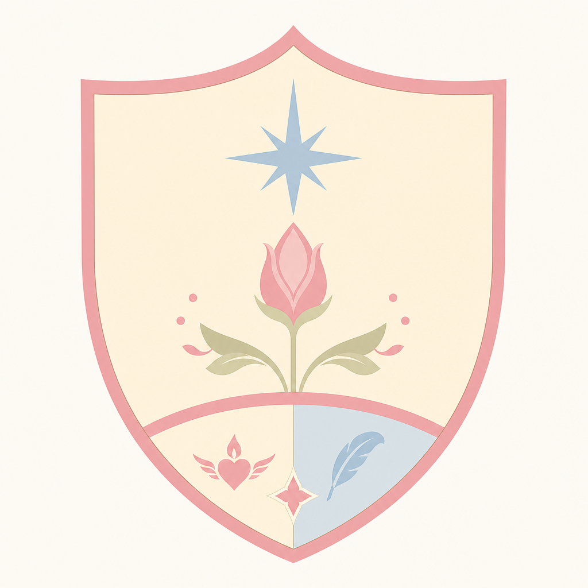
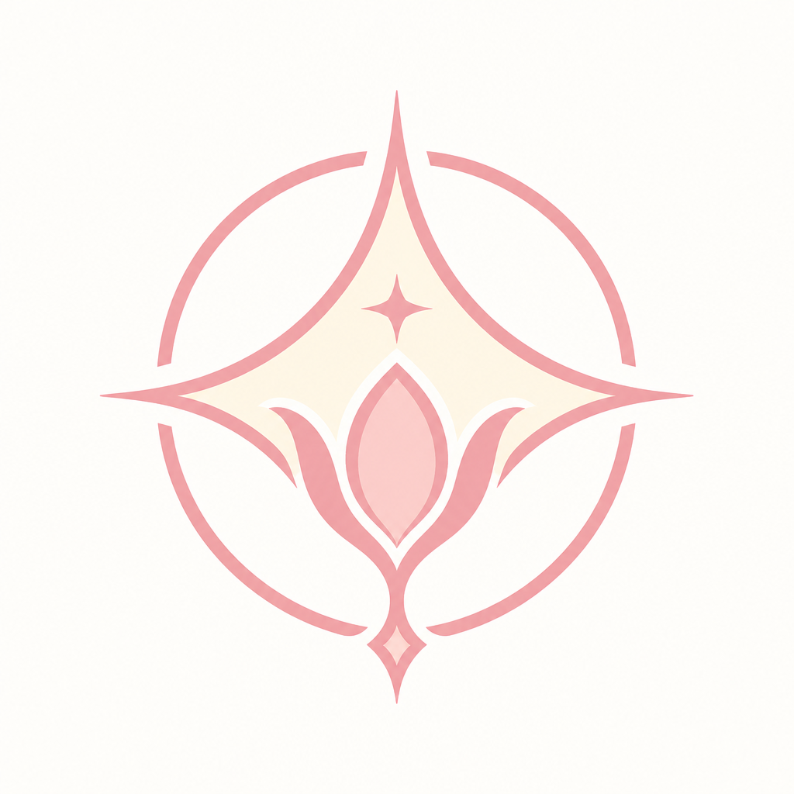

# Alzenhiem Crests and Sigils

Town flag, Knoleburn family crests, and simpler personal sigils for Dezco’s home hamlet.

## Crest tradition

In Alzenhiem, signs are not noble vanity. They are a naming rite.

When a child is born, elders and parents shape a crest that must hold three truths at once:

1. The name they are given (what the family hopes they will grow toward)
2. Their gender (how the hamlet marks son or daughter in the old local way)
3. Marks inherited from both parents (so the child is never drawn as if they appeared from nowhere)

Parent crests are the fuller household signs, made when Dolkin and Fulfein came of age and later joined their lives. Child crests stay simpler on purpose. A newborn should not be buried under a complicated fate. The design is unique, but readable: one clear personal emblem, small parent echoes, and colors chosen to the child’s vibe as the family first felt it in the cradle.

A sigil is made the same day as the crest. Crests are for doors, cloth, and formal keeping. Sigils are for wax, tools, letters, and quick recognition: one mark, same colors, same soul, fewer lines.

## Town flag: Alzenhiem

**Colors:** wheat gold, meadow green, earth brown, cream

**Meaning:** roof, wheat, and the lane that knows your footsteps.

**Significance:** Alzenhiem’s flag is not a conquest banner. It is a promise of ordinary shelter. The roof says people stay. The wheat says people feed each other. The lane says everyone is known before they are ranked.

**Why it was designed this way:** The hamlet chose symbols any child could draw in dirt. No crowns. No beasts of war. Gold for harvest hope, green for living ground, brown for honest work, cream for open sky over small homes. When Knoleburn children receive personal crests, this flag is the ground those crests stand on: you may leave, but you were named under a roof that expected you back.

GitHub: https://github.com/Dralorex/General-Questions/blob/main/assets/crests/alzenhiem/alzenhiem-town-crest.png

## Dolkin Knoleburn (father, 38)

### Crest

**Colors:** charcoal, iron gray, bronze amber

**Meaning:** a stone arch and hammer: work that holds, and shelter that does not boast.

**Significance:** Dolkin’s crest is the Dwarven depth in the family made visible. Charcoal and iron are the cave and the tool. Bronze amber is the warm spark of labor well done, not the glitter of status. The arch is protection. The hammer is responsibility. Together they say a man is measured by what he builds and what he keeps standing.

**Why it was designed this way at his naming:** Dolkin was named for steadfastness. His parents and hamlet elders read a quiet, heavy nature in him even as a boy coming into his adult mark. They chose stone over leaf, hammer over blade, dark metals over bright ones, because his path was never meant to dazzle. It was meant to bear weight. The masculine form of Alzenhiem’s household marks appears here as solid geometry and downward rooted strength: a father’s sign before he was a father.

### Sigil

**Mark:** a hammer strike held inside a stone arch.

**Meaning:** the whole crest reduced to one act: strike true, hold firm.

**Significance:** On letters, tools, and wax, Dolkin’s sigil means the work has been claimed by someone who finishes what he starts. It is also a quiet ward: the arch around the strike says power should stay framed by duty.

**Why this form:** A father needed a mark that could be carved quickly into wood or pressed into seal wax without losing its truth. The arch and hammer were already his crest’s heart, so the sigil keeps only that heart.

Crest: https://github.com/Dralorex/General-Questions/blob/main/assets/crests/alzenhiem/dolkin-crest.png

Sigil: https://github.com/Dralorex/General-Questions/blob/main/assets/crests/alzenhiem/dolkin-sigil.png

## Fulfein Knoleburn (mother, 36)

### Crest

**Colors:** sage green, silver, pale gold

**Meaning:** a leaf curling around a crescent: living care under gentle light.

**Significance:** Fulfein’s crest carries the Elven grace in the family without turning soft into weak. Sage is growth that knows seasons. Silver is clear sight. Pale gold is warmth that does not burn. The leaf is nurture. The crescent is watchfulness through dark hours. This is a mother’s sign as much as an Elven one: she sees, she tends, she stays.

**Why it was designed this way at her naming:** Fulfein was named for fullness of spirit and quiet shining. Elders saw in her a nature that healed rooms just by entering them. They refused harsh angles and war beasts. They chose leaf and moon so her mark would bless growth and night alike. The feminine household form in Alzenhiem often uses curve and living line; Fulfein’s crest is that tradition at its clearest.

### Sigil

**Mark:** a leaf curling into a crescent.

**Meaning:** care and vigilance braided into one stroke.

**Significance:** Her sigil on a letter means the words come with protection, not just affection. On a household tag, it means the thing beneath it has been watched over.

**Why this form:** The crest’s two motifs were already nearly one shape. The sigil completes that marriage of leaf and moon into a single seal a child could recognize from across a table.

Crest: https://github.com/Dralorex/General-Questions/blob/main/assets/crests/alzenhiem/fulfein-crest.png

Sigil: https://github.com/Dralorex/General-Questions/blob/main/assets/crests/alzenhiem/fulfein-sigil.png

## Dezco Knoleburn (son, 17)

### Crest

**Colors:** crimson red and deep black

**Meaning:** a blade or rising flame split between red and black: resolve held in balance.

**Significance:** Dezco’s crest is a child crest, simpler than his parents’, yet heavier with joined blood. Tiny echoes of Dolkin’s stone and Fulfein’s leaf sit near a personal upright mark. Red and black are not costume colors. They are the vibe the family felt in him from the start: intensity, contrast, a life that would have to hold darkness and living fire together. The masculine child form is upright and pointed, but not crowded with adult claims.

**Why it was designed this way at birth:** When Dezco was born and named, Alzenhiem’s naming rite asked what the child already seemed to carry. Dolkin’s people saw deep shadow that did not frighten the boy. Fulfein’s people saw a vital heat that answered hurt with life. The makers therefore refused a single parent’s palette. They set red against black as equal halves, then placed a simple blade or flame between small parent marks so the baby’s crest would confess both lines without pretending he was only one. They kept the design spare because prophecy had no place on a cradle shield. He was named Dezco for a path of standing firm; the crest says standing firm will mean balance, not purity of one side.

### Sigil

**Mark:** a vertical blade or flame divided into red and black.

**Meaning:** one decision, two natures, no apology.

**Significance:** The sigil is how Dezco’s name travels when there is no room for a full crest: on seals, gear, and later on things he must claim as his own. It tells the truth faster than rumor can. Balance is the point. Not half measures. Whole contrast held in one cut.

**Why this form:** At birth the sigil was cut from the crest’s center so a child mark would remain recognizable even if the parent echoes were too fine for wax. Red and black alone were enough to say who he was becoming.

Crest: https://github.com/Dralorex/General-Questions/blob/main/assets/crests/alzenhiem/dezco-crest.png

Sigil: https://github.com/Dralorex/General-Questions/blob/main/assets/crests/alzenhiem/dezco-sigil.png

## Kalhien Knoleburn (son, 15)

### Crest

**Colors:** ink blue and copper

**Meaning:** a forward chevron or eager running mark: motion toward a place not yet reached.

**Significance:** Kalhien’s crest names the restless pride of a second son without insulting him. Ink blue is deep will and night thinking. Copper is bright heat that wants to prove itself now. The forward mark leans into the future. Small parent echoes remain, because he is still Dolkin and Fulfein’s, but the center belongs to his own hunger to catch up, to be seen as himself.

**Why it was designed this way at birth:** Kalhien was born into a house that already had an older brother whose absence and reputation would one day stretch long. The naming rite felt urgency in him even as an infant: fists, quick eyes, a spirit that strained toward whatever stood ahead. They named him Kalhien for rising and pursuit. They chose a masculine child crest that points forward instead of standing still like Dezco’s blade. Blue and copper were picked so he would not live under red and black’s shadow. His colors had to be his, or the hamlet feared he would spend his life borrowing someone else’s legend.

### Sigil

**Mark:** a forward chevron of eager motion.

**Meaning:** I am coming. Make room by merit, not by pity.

**Significance:** Kalhien’s sigil is almost impatient on purpose. On a practice tag or letter it reads as challenge and promise together. It protects his right to a path that is not merely “Dezco’s younger brother.”

**Why this form:** The birth sigil stripped the crest to the forward angle alone so his mark could never be mistaken for his brother’s balanced blade.

Crest: https://github.com/Dralorex/General-Questions/blob/main/assets/crests/alzenhiem/kalhien-crest.png

Sigil: https://github.com/Dralorex/General-Questions/blob/main/assets/crests/alzenhiem/kalhien-sigil.png

## Astiale Knoleburn (daughter, 8)

### Crest

**Colors:** soft rose, cream, pale sky

**Meaning:** a blossoming bud or gentle star: sweetness that is still becoming.

**Significance:** Astiale’s crest is the tenderest of the set, and that is its strength. Rose is affection. Cream is unspoiled light. Pale sky is room to grow. The bud or soft star says she was named as promise, not as weapon. Parent marks remain small beside her, so she is held by the house without being made into its shield.

**Why it was designed this way at birth:** Astiale arrived years after Dezco had already left for training. The hamlet refused to write war onto her cradle. They felt in her a sweet, open nature and named her Astiale for gentle rising, like a star or a breath at dawn. The feminine child form in Alzenhiem uses soft curves and living bloom. Rose, cream, and sky were chosen so her vibe could stay soft without being dismissed as empty. Significance here is protection through gentleness: a reminder that the Knoleburn house is not only stone, leaf, blade, and chase. It is also someone who should be allowed to remain kind.

### Sigil

**Mark:** a soft bud or gentle star curve.

**Meaning:** I am growing. Do not hurry me into hardness.

**Significance:** Her sigil on a toy box, letter, or keepsake marks belonging and blessing. It is the family’s softest seal, and they treat it that way on purpose.

**Why this form:** At birth they wanted one shape a sister could love as she learned her own name. The crest’s bloom simplified cleanly into a sigil that still feels like her, even when drawn with a child’s hand.

Crest: https://github.com/Dralorex/General-Questions/blob/main/assets/crests/alzenhiem/astiale-crest.png

Sigil: https://github.com/Dralorex/General-Questions/blob/main/assets/crests/alzenhiem/astiale-sigil.png

## Quick color map

| Person or place | Colors | Core idea |
|---|---|---|
| Alzenhiem | gold, green, brown, cream | home that shelters and feeds |
| Dolkin | charcoal, iron, bronze | bear weight, keep shelter |
| Fulfein | sage, silver, pale gold | tend, watch, warm |
| Dezco | red and black | balance of void and living fire |
| Kalhien | ink blue and copper | pursue your own name |
| Astiale | rose, cream, sky | grow kindly |

## Notes

Child crests keep a small echo of Dolkin’s stone mark and Fulfein’s leaf mark, then center a personal symbol for the child’s own name and path. Sigils strip that down to a single personal glyph made on the same naming day as the crest.
